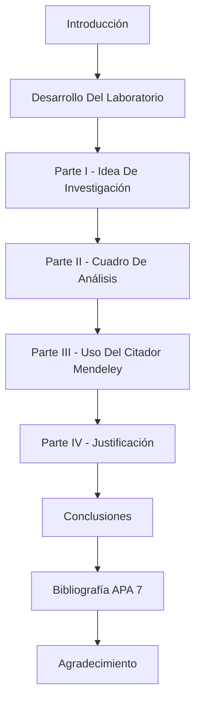
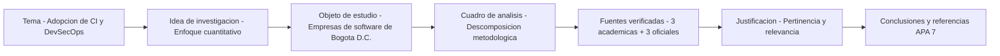

# 🔐 Idea de Investigación — Adopción de Integración Continua y DevSecOps

### *Nivel de adopción de prácticas de CI y DevSecOps en empresas de desarrollo de software de Bogotá D.C.*

**Asignatura: Aproximación a la Metodología de Investigación · Actividad Laboratorio No. 2 — Idea de Investigación**

**[Contexto](#-contexto-y-alcance) • [Contenido](#-contenido-del-repositorio) • [Herramientas](#-herramientas-utilizadas) • [Estructura](#-estructura-del-documento) • [Fuentes](#-fuentes-principales) • [Autor](#-autor)**

---

## 📋 Tabla de Contenidos

- [🎯 Contexto y Alcance](#-contexto-y-alcance)
- [📁 Contenido del Repositorio](#-contenido-del-repositorio)
- [🧰 Herramientas Utilizadas](#-herramientas-utilizadas)
- [📐 Estructura del Documento](#-estructura-del-documento)
- [🔁 Hilo Argumental del Ensayo](#-hilo-argumental-del-ensayo)
- [📚 Fuentes Principales](#-fuentes-principales)
- [🔖 Gestión Bibliográfica](#-gestión-bibliográfica)
- [📄 Cómo Consultar el Documento](#-cómo-consultar-el-documento)
- [✅ Contenido Verificable del Documento](#-contenido-verificable-del-documento)
- [📝 Nota](#-nota)
- [👥 Autor](#-autor)

---

## 🎯 Contexto y Alcance

Este repositorio contiene el documento de la **Actividad Laboratorio No. 2: Idea de Investigación**, desarrollado en el marco de la asignatura **Aproximación a la Metodología de Investigación**.

El trabajo plantea, en forma de **ensayo**, una **idea de investigación cuantitativa** sobre el nivel de adopción de prácticas de **integración continua (CI)** y **DevSecOps** en empresas de desarrollo de software de **Bogotá D.C.**

> **Enfoque:** cuantitativo.
> **Objeto de estudio:** empresas de desarrollo de software de Bogotá D.C.
> **Interés central:** medir en qué grado esas empresas incorporan CI y prácticas de seguridad integradas al ciclo de desarrollo (DevSecOps).

### 🌟 ¿Qué aporta este documento?

- 🎯 **Idea de investigación acotada**, con enfoque, objeto de estudio y ámbito geográfico definidos.
- 🧮 **Cuadro analítico** que descompone la idea en sus elementos metodológicos.
- 📚 **Fuentes verificadas**: tres artículos académicos y tres fuentes oficiales.
- 🔖 **Trazabilidad bibliográfica** mediante Mendeley y formato APA 7ª edición.

---

## 📁 Contenido del Repositorio

<table align="center">
  <tr><th>Elemento</th><th>Descripción</th></tr>
  <tr><td><code>Desarrollo_Proyecto_Alejandro_De_Mendoza_Tovar.pdf</code></td><td>📘 Documento final de la actividad: idea de investigación, cuadro analítico, justificación, conclusiones y referencias en formato APA 7ª edición</td></tr>
  <tr><td><code>README.md</code></td><td>📄 Este documento</td></tr>
  <tr><td><code>.gitignore</code></td><td>🚫 Mantiene en local los documentos editables (<code>.docx</code>, <code>.doc</code>), los archivos temporales de Word y las carpetas de borradores</td></tr>
</table>

> ℹ️ El repositorio versiona **únicamente el PDF final**. Los enunciados, las versiones editables en Word (`.docx`) y cualquier material de trabajo quedan excluidos vía `.gitignore` y permanecen solo en local.

---

## 🧰 Herramientas Utilizadas

| Componente | Uso |
|:---|:---|
| **Microsoft Word** | Redacción del ensayo y del cuadro analítico |
| **Mendeley** | Organización de las fuentes y de la biblioteca de referencias |
| **Mendeley Cite** | Inserción de citas y generación de la lista de referencias en Word |
| **APA 7ª edición** | Norma de citación y referenciación |
| **Biblioteca UNIR** | Consulta de los artículos académicos |
| **Mermaid** | Diagramas de estructura y de hilo argumental de este README |

---

## 📐 Estructura del Documento

---

## 🔁 Hilo Argumental del Ensayo

---

## 📚 Fuentes Principales

El análisis se sustenta en **seis fuentes verificadas**: tres artículos académicos consultados en **Biblioteca UNIR** y tres fuentes oficiales.

| Fuente | Tipo | Origen |
|:---|:---|:---|
| Muñoz et al. (2021) | Artículo académico | Biblioteca UNIR |
| Orozco et al. (2022) | Artículo académico | Biblioteca UNIR |
| Cruz González & Franco Calderón (2023) | Artículo académico | Biblioteca UNIR |
| Ministerio TIC (MinTIC) | Fuente oficial | Política pública TIC · Colombia |
| NIST | Fuente oficial | Referencia internacional en ciberseguridad |
| OWASP Foundation | Fuente oficial | Buenas prácticas de seguridad en software |

---

## 🔖 Gestión Bibliográfica

Las citas y referencias se gestionaron con **Mendeley**, mediante el complemento **Mendeley Cite para Microsoft Word**, garantizando trazabilidad y formato **APA 7ª edición** en todo el documento.

---

## 📄 Cómo Consultar el Documento

1. Descargar o abrir `Desarrollo_Proyecto_Alejandro_De_Mendoza_Tovar.pdf` desde este repositorio.
2. Seguir la estructura descrita en [📐 Estructura del Documento](#-estructura-del-documento): de la introducción a las cuatro partes del laboratorio.
3. Revisar el **cuadro de análisis** (Parte II) para ver la descomposición metodológica de la idea.
4. Consultar la **bibliografía en APA 7** al final del documento para verificar las fuentes.

---

## ✅ Contenido Verificable del Documento

<b>🔎 Ver elementos que incluye el PDF</b>

| Elemento | Sección | Incluido |
|:---|:---|:---:|
| Idea de investigación | Parte I | ✔ |
| Cuadro de análisis | Parte II | ✔ |
| Uso del citador Mendeley | Parte III | ✔ |
| Justificación | Parte IV | ✔ |
| Conclusiones | Cierre | ✔ |
| Bibliografía en APA 7ª edición | Referencias | ✔ |
| Agradecimiento | Cierre | ✔ |

---

## 📝 Nota

Este documento corresponde a una **actividad académica**. La idea de investigación se plantea con fines formativos dentro de la asignatura y no constituye un estudio de campo ya ejecutado.

---

## 👥 Autor

Trabajo desarrollado en el marco de la asignatura **Aproximación a la Metodología de Investigación**.

| Autor | Perfil |
|:---:|:---:|
| **Alejandro De Mendoza** |  |

---

### 🔐 *La adopción de DevSecOps no se supone: se mide con evidencia sobre las empresas que desarrollan software*

**Aproximación a la Metodología de Investigación · Actividad Laboratorio No. 2 · Idea de Investigación**

