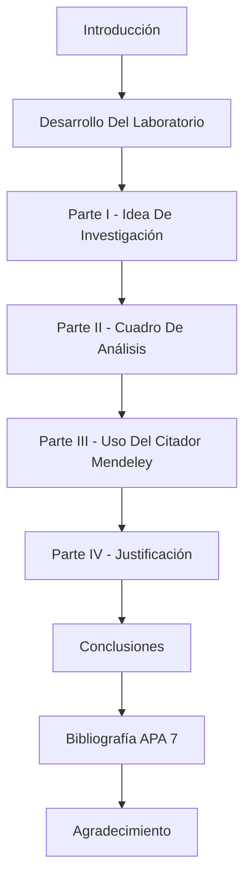

# Idea De Investigación - Aproximación A La Metodología De Investigación - Adopción De Integración Continua Y DevSecOps En Empresas De Desarrollo De Software De Bogotá D.C.

---

Este repositorio contiene el documento de la **Actividad Laboratorio No. 2: Idea de Investigación**, desarrollado en el marco de la asignatura **Aproximación a la Metodología de Investigación**. El trabajo plantea, en forma de ensayo, una idea de investigación cuantitativa sobre el nivel de adopción de prácticas de integración continua y DevSecOps en empresas de desarrollo de software de Bogotá D.C.

## Contenido del repositorio:

- `Desarrollo_Proyecto_Alejandro_De_Mendoza_Tovar.pdf` → Documento final de la actividad: idea de investigación, cuadro analítico, justificación, conclusiones y referencias en formato APA 7ª edición.

## Estructura del documento

## Fuentes principales

El análisis se sustenta en seis fuentes verificadas: tres artículos académicos consultados en Biblioteca UNIR (Muñoz et al., 2021; Orozco et al., 2022; Cruz González & Franco Calderón, 2023) y tres fuentes oficiales (Ministerio TIC, NIST y OWASP Foundation).

## Gestión bibliográfica

Las citas y referencias se gestionaron con **Mendeley**, mediante el complemento Mendeley Cite para Microsoft Word, garantizando trazabilidad y formato APA 7ª edición.

## Autor:

Este trabajo fue desarrollado en el marco de la asignatura **Aproximación a la Metodología de Investigación**.

- ***Alejandro De Mendoza*** – [Perfil GitHub](https://github.com/AlejoTechEngineer)

---
